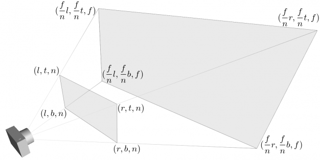

> Note that using NDC coordinate boosted performance only for LLFF-style forward facing data.
> [link](https://github.com/bmild/nerf/blob/master/run_nerf.py#L424) to the author's comment.

## What is NDC space?

NDC space is a transformed coordinate where all visible points (points in a viewing frustum) lie in the normalized interval. [terminology reference](https://www.scratchapixel.com/lessons/3d-basic-rendering/get-started/gentle-introduction-to-computer-graphics-programming.html)

Although NDC is commonly used terminology, its definition differs from framework to framework. In NeRF paper, they utilized the 3D NDC coordinate where all x,y,z coordinates lie in range $[-1,1]$. In other words, the viewing frustum is transformed to a $[-1,1]^3$ cube.

## How to Transform; Camera to NDC

[This post](http://www.songho.ca/opengl/gl_projectionmatrix.html) gives the thorough explanation of the transformation. To make a transformation, we need six parameters: `l,r,t,b,n,f`. The image below visualize the parameters (image from [www.songho.ca](http://www.songho.ca/opengl/gl_projectionmatrix.html)). 

- We assume the viewing canvas is aligned with the camera coordinate axes.
- `l,r` is the left and right side of the NEAR plane.
- `t,b` is the top and bottom side of the NEAR plane.
- `n` is the distance between the camera(pinhole) and the near plane. (aligned with z-axis)
- `f` is the distance between the camera(pinhole) and the far plane. (aligned with z-axis)
- NeRF assumes a symmetric view i.e. `l=-r, b=-t`.

The post above shows two transformations below.
1. mapping from eye coordinate(a.k.a. camera coord) to projection space on near plane.
2. transformation of points in the projections space to the normalized interval $[-1,1]$.

Thanks to the two transformations, we can derive the transformation matrix from camera coordinate to NDC.

$$
M = \begin{bmatrix}
{n \over r} & 0 & 0 & 0 \\
0 & {n \over t} & 0 & 0 \\
0 & 0 & -{f+n \over f-n} & -{2fn \over f-n} \\
0 & 0 & -1 & 0
\end{bmatrix}
$$

Using the matrix, $(x,y,z)$ point at camera coordinate is mapped to $(-{n\over r}{x \over z}, -{n\over t}{y \over z}, {f+n \over f-n} + {2fn \over f-n} {1 \over z})$

## NDC in NeRF

This section referenced the author's answer on his [github issue](https://github.com/bmild/nerf/issues/18).

We have two vectors for ray casting in the camera coordinate. These two vectors give us a parametrized ray; $\mathbf{o} + t \mathbf{d}$.

- $\mathbf{o}$ : The position of the camera origin(pinhole)
- $\mathbf{d}$ : A directional vector from the camera origin to a pixel in the image space.

We want to find a corresponding ray in the NDC space; $\mathbf{o}' + t' \mathbf{d}'$. The speed of two rays can differ from each other, but both should pass through the same corresponding points. $\pi$ denotes the mapping from the camera space to the NDC space using the matrix $M$.

$$
\pi(\mathbf{o} + t \mathbf{d}) = M \cdot (\mathbf{o} + t \mathbf{d})
$$

Before we dive into the equations, let's define some constants so that we can simplify the equations.

$$\begin{aligned}
a_x &= -n/r & a_y &= -n/t \\
a_z &= {f+n \over f-n} & b_z &= {2fn \over f-n}
\end{aligned}$$

In pinhole camera, the ratio $n/r$ can be reparametrized by the intrinsic parameter $f_{cam} \over W/2$ where $f_{cam}$ denotes focal length and $W$ denotes width of the image. Furthermore, NeRF added one more assumption that its view frustum extends to the infinity, which means that the far scene bound $f$ goes to infinity: $f \to \infty$.

$$\begin{aligned}
a_x &= = -{f_{cam} \over W/2} & a_y &= = -{f_{cam} \over H/2} \\
a_z &= 1 & b_z &= 2n
\end{aligned}$$

The author introduced a constraint that both $t=0$ and $t'=0$ map to the same point. This gives $\mathbf{o}'$

$$
\mathbf{o}'
= \begin{bmatrix}
    a_x {o_x \over o_z} \\
    a_y {o_y \over o_z} \\
    a_z + {b_z \over o_z}
\end{bmatrix}
= \begin{bmatrix}
    -{f_{cam} \over W/2} {o_x \over o_z} \\
    -{f_{cam} \over H/2} {o_y \over o_z} \\
    1 + {2n \over o_z}
\end{bmatrix}
$$

Now, we can inspect $t' \mathbf{d}' = \pi(\mathbf{o} + t\mathbf{d}) - \mathbf{o}'$. This gives

$$
\begin{aligned}
\begin{bmatrix}
    t'd'_x \\ t'd'_y \\ t'd'_z
\end{bmatrix}
&= \begin{bmatrix}
    a_x {o_x+td_x \over o_z + td_z} - a_x {o_x \over o_z} \\
    a_y {o_y+td_y \over o_z + td_z} - a_y {o_y \over o_z} \\
    a_z + {b_z \over o_z + td_z} - a_z - {b_z \over o_z}
\end{bmatrix} \\
&= \begin{bmatrix}
    a_x {td_z \over o_z + td_z} ({d_x \over d_z} - {o_x \over o_z}) \\
    a_y {td_z \over o_z + td_z} ({d_y \over d_z} - {o_y \over o_z}) \\
    -b_z {td_z \over o_z + td_z} {1 \over o_z}
\end{bmatrix}
\end{aligned}
$$

We can factor out the common component from all three coordinates as $t'$. The equation below still holds the constraint that when $t'=0$ when $t=0$.

$$
\begin{aligned}
t' &= {td_z \over o_z + td_z} = 1 - {o_z \over o_z + td_z} \\
\mathbf{d}' &= \begin{bmatrix}
    a_x ({d_x \over d_z} - {o_x \over o_z}) \\
    a_y ({d_y \over d_z} - {o_y \over o_z}) \\
    -b_z {1 \over o_z}
\end{bmatrix}
= \begin{bmatrix}
    -{f_{cam} \over W/2} ({d_x \over d_z} - {o_x \over o_z}) \\
    -{f_{cam} \over H/2} ({d_y \over d_z} - {o_y \over o_z}) \\
    - {2n \over o_z}
\end{bmatrix}
\end{aligned}
$$

Now, we have the mapping between the rays in camera coordinate and the rays in NDC coordinate.

## Modify Ray Origin for Sampling

The ray between the origin $\mathbf{o}$ and the near plane is assumed to be transparent. Therefore, we should not sample points in this range. In order not to sample this range, we should sample $t \ge -(n+o_z)/d_z$ which gives $z \leq -n$.

Instead of sampling $t$ from range $[-(n+o_z)/d_z, \infty]$, NeRF moved the start start point of rays.
$$
\begin{aligned}
&\mathbf{o} + t\mathbf{d} && where.\ t \ge -(n+o_z)/d_z \\
\iff &\underbrace{\mathbf{o} + (-(n+o_z)/d_z)\mathbf{d}}_{\text{new origin}} + t\mathbf{d} && where.\ t \ge 0
\end{aligned}
$$

Before, all rays share a common start point, but each ray has its own start point from now.

We have to note that $t=0$ gives $t'=0$ and $t \to \infty$ gives $t'=1$. By changing the ray origin, we can sample $t$ from range $[0,\infty]$ and this is equivalent to sampling $t'$ from range $[0,1]$.